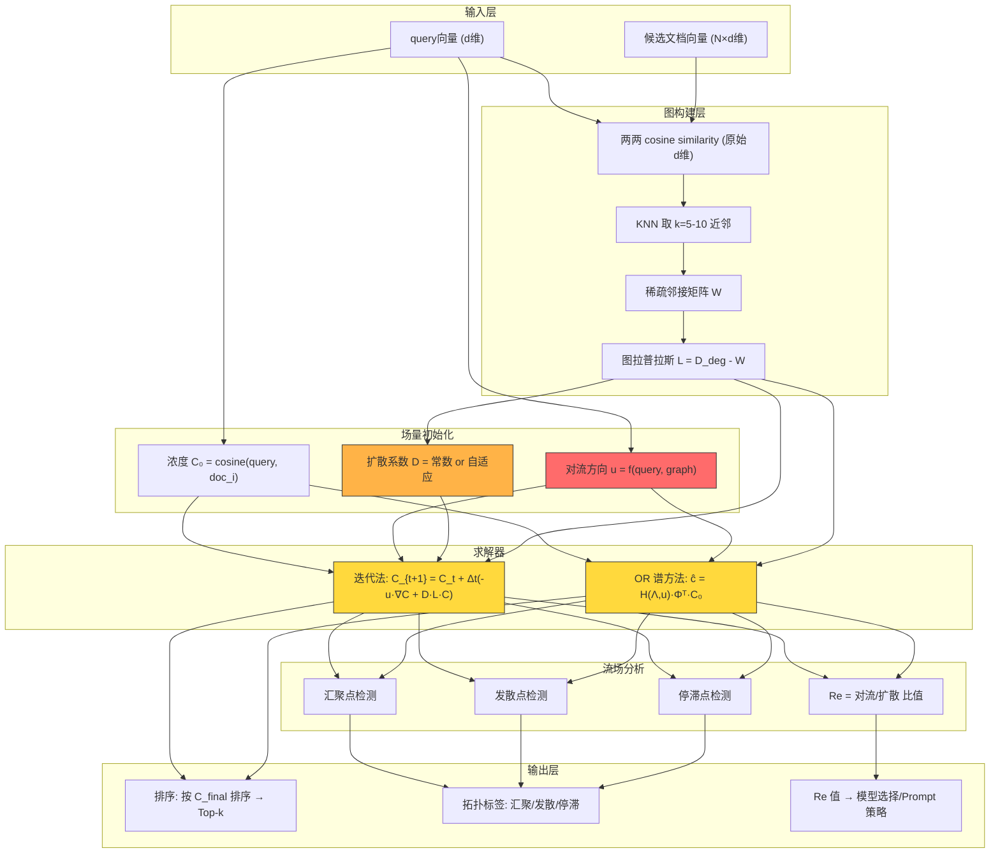
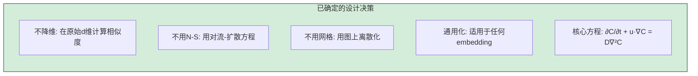
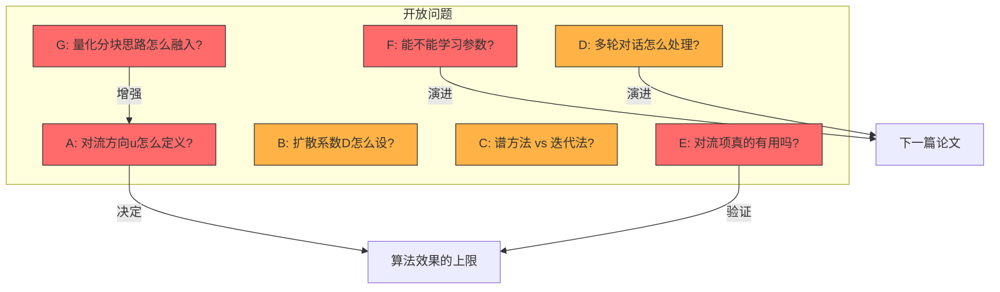
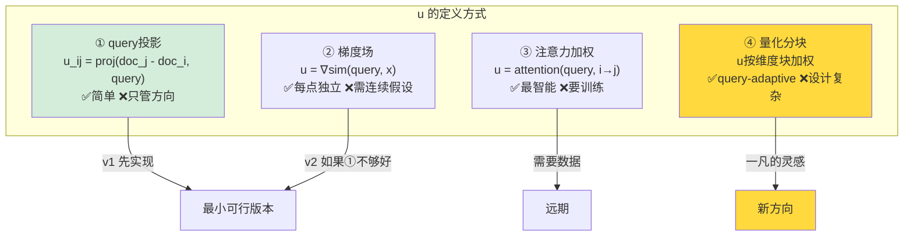
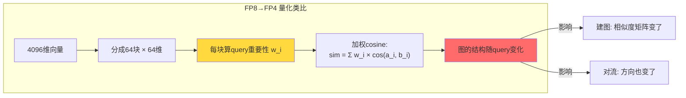
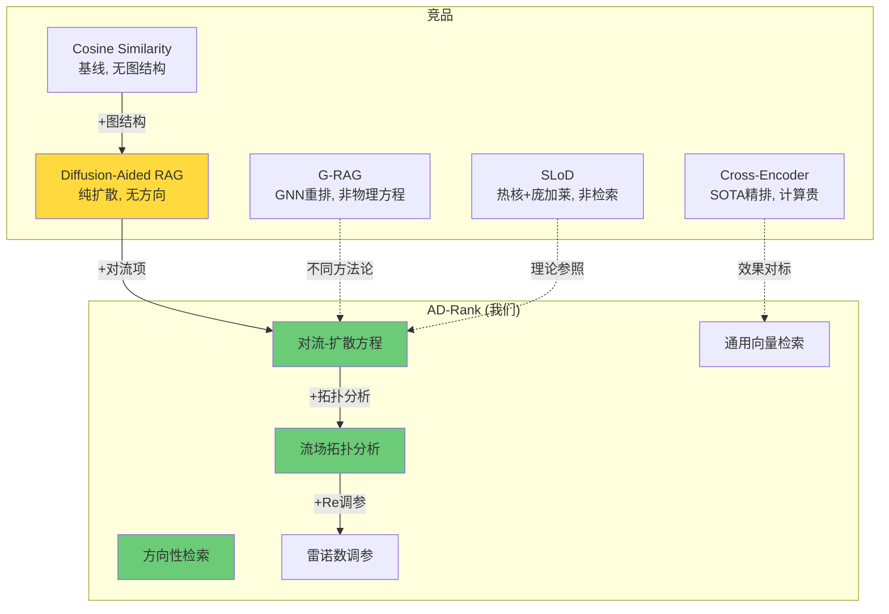
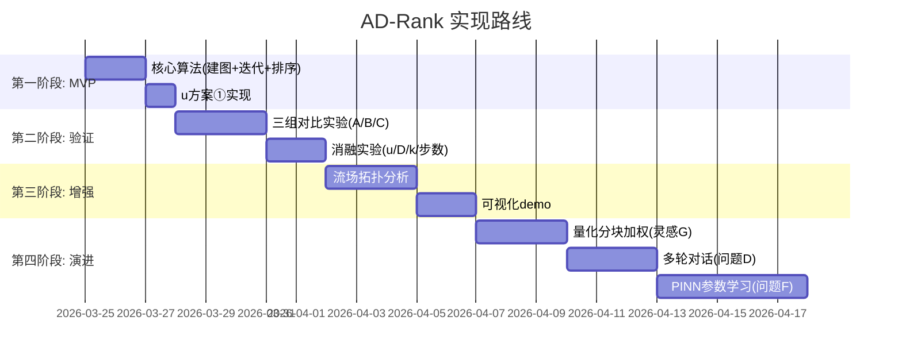

# AD-Rank 技术全景图

> 2026-03-24 | 一凡 + Antigravity 研究讨论产出
> ⚠️ **注意**：此文档为早期设计阶段产物。当前最优方案已演化为 Shape-CFD V7.1 (PQ-Chamfer 64×64 + 伴随状态法预取，NDCG@10 = 0.2802)。最新信息请参考 `V5灵感演化路线图.md` 和 `HANDOFF.md`。

---

## 一、总体架构

---

## 二、每个模块的技术细节与开放问题

### 🟢 已确定

### 🔴 开放问题（需要灵感）

---

## 三、问题 A 展开：对流方向 u 的 4 种方案

---

## 四、问题 G 展开：量化分块思路

---

## 五、竞品对比总览

---

## 六、实现路线图

---

## 七、一句话速查表

| 编号 | 问题 | 当前状态 | 你的灵感可以改变什么 |
|:---:|:---|:---:|:---|
| **A** | 对流方向 u | 🔴 待定 | 量化分块思路可以让 u 变成 query-adaptive |
| **B** | 扩散系数 D | ✅ 已实现 | Fiedler value 自适应 D (Agent 9) |
| **C** | 求解方法 | 🟡 先迭代法 | 谱方法是性能升级路径 |
| **D** | 多轮对话 | 🟡 语义动量 | 流场记忆效应 |
| **E** | 有效性验证 | ✅ 已完成 | DeepSeek 盲评 + 全策略横评确认 v2 最优 |
| **F** | 参数学习 | 🔴 远期 | PINN 式训练 |
| **G** | 量化分块 | 🔴 新灵感 | 和 A 结合，改变建图方式 |
